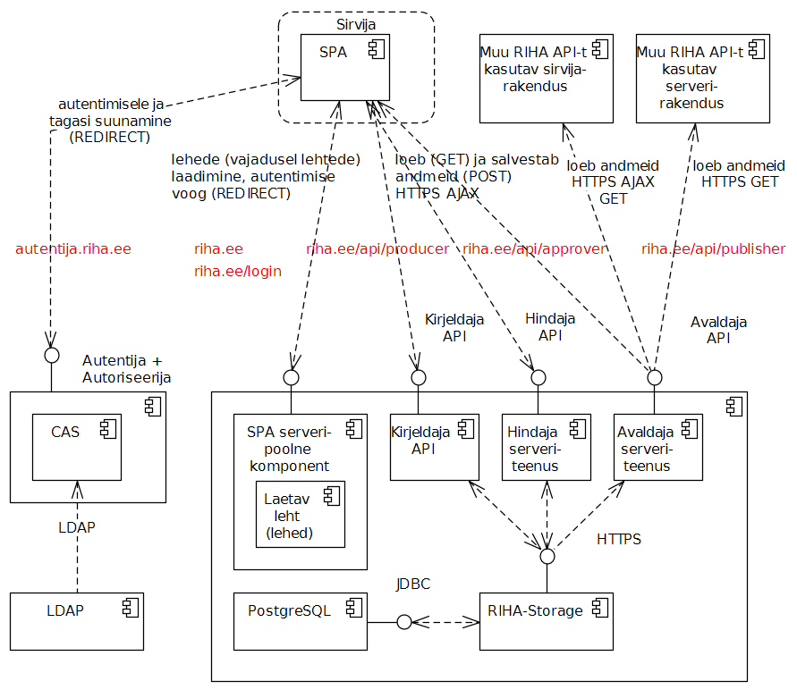

04.07.2017

***RIHA rakendus ja API ühe domeeni all***. RIHA API (üldnimetus Kirjeldaja API-le, Hindaja API-le ja Avaldaja API-le, samuti tulevikus lisanduda võivatele API-dele) on otstarbekas publitseerida RIHA kesksüsteemi rakendusega ühe domeeni all.

Erinevad domeenid poleks probleemiks API-des, kust andmeid ainult loetakse (nn avatud e _open_ API-d). Praegu on selliseks Avaldaja API. Sealt lugemine ei vaja autentimist. Samas pole ka välistatud, et tulevikus Avaldaja API mõnele osale on vaja juurdepääsu piirata.

***Domeeninimed ja URL-i teemustrid***. Ettepanek domeeninimedele ja URL-i teemustritele:

|  domeen/teemuster  | kasutus       |
|-----------|-------------|
| `riha.ee` | RIHA kesksüsteemi kasutajarakendus. Sellest domeenist laetakse rakenduse leht (kui vaja, siis ka täiendavad lehed). Allikas (_origin_) on `https:riha.ee:443`. |
| `riha.ee/login` | Selle URL-ga suunatakse kasutaja autentimisele |
| `riha.ee/OAuthCallback` | autentimiselt tagasisuunamise aadress |
| `riha.ee/api` | RIHA API |
| `riha.ee/api/producer` | Kirjeldaja API |
| `riha.ee/api/approver` | Hindaja API |
| `riha.ee/api/publisher` | Avaldaja API |
| `autentija.riha.ee` | RIHA autentimis- ja autoriseerimismoodulid |

***Väline juurdepääs ainult Avaldaja API-le***. Väline juurdepääs RIHA API-le on praegu mõistlik anda ainult Avaldaja API osas. See tähendab, et praegu me peame Kirjeldaja API ja Hindaja API kasutajatena silmas ainult RIHA kesksüsteemi rakendust (SPA-d). Muud rakendused (need võivad olla nii sirvijas töötavad Javascript-rakendused kui ka serverirakendused) võivad andmeid vabalt saada Avaldaja API kaudu. Sirvijarakendus saadab HTTPS GET AJAX-päringu, serverirakendus tavalise HTTPS GET päringu.

***Autentija ja autoriseerija eraldi domeenis***. Autentija ja autoriseerija võiksid  olla ka RIHA rakendusega ühes domeenis. Siiski pole see otstarbekas, sest: 1) autentimislahenduse eraldihoidmine on RIA mittefunktsionaalne nõue; 2) varem või hiljem on kavas RIHA-s kasutada välist autentimisteenust (RIA kavandatav ühtne autentimis- ja sessioonihaldusteenus).

Autentimija + Autoriseerija on mõtekas paigutada RIHA põhidomeenist `riha.ee` erineva domeeni alla (`autentija.riha.ee`).

***Ka CAS-i kasutamisel võimalikult OAuth 2.0 loogika ja JWT kasutamine***. Ka CAS-i kasutamisel tuleks teostada OAuth 2.0 või OpenID Connect loogika, seejuures kasutada pääsuvolituste (_authentication token_) esitamiseks JWT kuju. Põhjus on siin selles, et kavandatav RIA ühtne autentimis- ja sessioonihaldusteenus hakkab teenust pakkuma OpenID Connect protokolli kohaselt. Meil oleks vajadusel kergem üle minna.

## Põhjendusi

Millest lähtuda domeenide süsteemi valikul? Moodulpõhimõte ei ole ainus kaalutlus. Moodulpõhimõte kehtib ka ühe domeeni alla paigutamise korral. Eri domeenidega API-de kasutamine oleks lihtne, kui andmeid ainult loetaks (GET päringud). Andmete salvestamisel (POST päringud) see enam triviaalne ei ole. See oleks teostatav, kuid nõuaks OpenID Connect ja JWT kogemust ja hästitöötavat vastavat autentimisteenust.

Eraldi paigaldamine meie puhul ei ole kasu, vaid vastupidi, asi, mida pragmaatilistel põhjustel tuleks piirata.

Küll aga tuleks erineva turvakontekstiga ja turbevajadusega rakendused hoida eraldi domeenides. Heaks näiteks on domeen `arhitektuur.riha.ee`. Selles on avaldatud arhitektuuriteatmik. Kui domeen `arhitektuur.riha.ee` ja `riha.ee` oleksid juurdepääsude andmise aspektist seotud (praegu ei ole), siis oleks võimalik teoreetiline ründevektor, kus arhitektuuriteatmiku koostaja (nt arhitekt või arhitekti kontole juurdepääsu saanud ründaja) kirjutab arhitektuuriteatmikku sisse koodi (GitHub Jekyll-süsteemis on see võimalik), mis abil on võimalik saada volitamata juurdepääsu RIHA API-le (murdskriptimine).