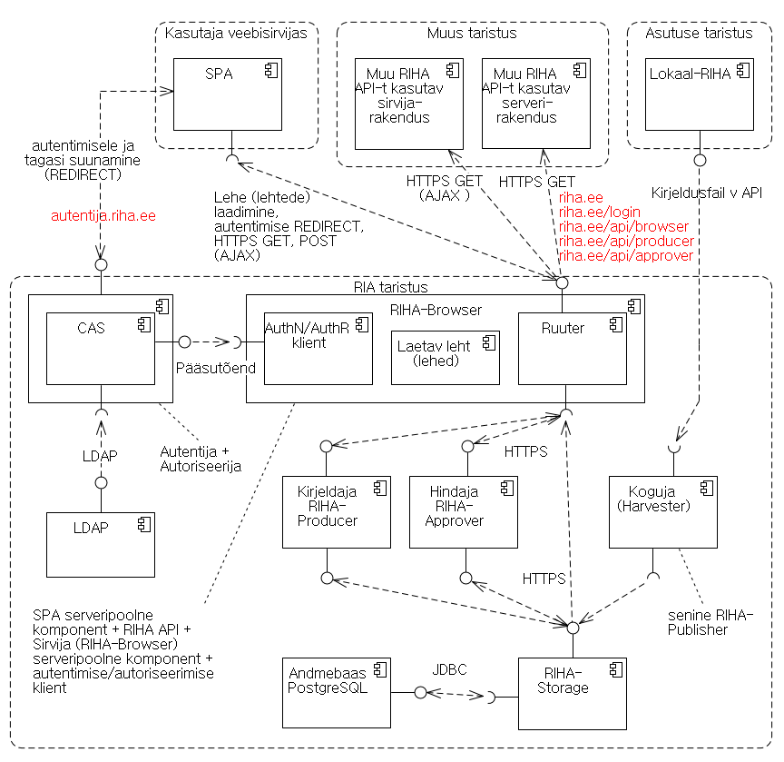

# Aktuaalne arhitektuurikirjeldus

14.07.2017 
eelmine versioon: 04.07.2017

***Komponendid***

| kesksüsteemi komponent      | lahendatav ülesanne      |
|-------------------------------|--------------------------|
| `SPA (üheleherakendus)`         | Kasutaja veebisirvijas töötav, ühtset kasutajakogemust pakkuv rakendus. Lehe (või lehtede) laadimiseks, andmete pärimiseks ja salvestamiseks suhtleb kesksüsteemi komponendiga `RIHA-Browser`. |
| `RIHA-Browser`                  | Kesksüsteemi komponent, mis pakub RIHA API vormis andmeid kesksüsteemist väljapoole, edastab veebisirvijasse SPA lehe (või lehed), täidab SPA saadetud AJAX-päringuid, korraldab autentimise ja autoriseerimise voo. |
| `Ruuter`                        | Võtab vastu kesksüsteemi serveripoolele tuleva HTTPS päringu ja korraldab selle täitmise. Selleks suhtleb `RIHA-Browser` komponentidega, `Kirjeldajaga (RIHA-Producer`, `Hindajaga (RIHA-Approver` ja `RIHA-Storage`-ga. |
| `AuthN/AuthR klient` | `RIHA-Browser`-i komponent, suhtleb `Autentija-Autoriseerijaga`. | 
| Laetav leht (lehed) | `SPA` lähtekood (HTML, CSS, Javascript jm ressursid). | 
| `Kirjeldaja` (`RIHA-Producer`)    | Korraldab infosüsteemi vm objekti kirjelduse salvestamise kesksüsteemi andmebaasi (pöördumisega `RIHA-Browser` poole); korraldab kirjelduse lugemise andmebaasist ja edastamise `Ruuterile`. |
| `Hindaja` (`RIHA-Approver`)       | Korraldab hinnangu salvestamise kesksüsteemi andmebaasi. |
| `Koguja` (`Harvester`)            | Kogub lokaal-RIHA-dest kokku kirjeldused ja salvestab need kesksüsteemi andmebaasi. |
| `RIHA-Storage`                  | Teenindab kesksüsteemi komponente `Kirjeldaja (RIHA-Producer)`, `Hindaja (RIHA-Approver` ja `Koguja (Harvester`, salvestades andmeid `Andmebaasi` ja väljastades salvestatud andmeid. Kasutamine HTTPS REST API kaudu. |
| `Andmebaas (PostgreSQL)`        | Hoiab nii kesksüsteemis loodud kui ka kesksüsteemi kogutud teavet. |
| `Autentija+Autoriseerija (CAS)` | Autendib ja autoriseerib kasutaja. |
| `LDAP`                          | Hoiab kasutajate rolle. |

| väliskomponent              | lahendatav ülesanne      |
|-------------------------------|--------------------------|
| `Lokaal-RIHA`                   | Võimaldab kirjelduste koostamist ja majutamist asutuse soovil asutuse enda taristus. |
| Muu RIHA API-t kasutav sirvijarakendus | RIHA-sse kogutud andmete kasutamine teistes süsteemides. |
| Muu RIHA API-t kasutav serverirakendus | RIHA-sse kogutud andmete kasutamine teistes süsteemides. |

***Domeeninimed ja URL-i teemustrid***
 
|  domeen/teemuster  | kasutus       |
|-----------|-------------|
| `riha.ee` | RIHA kesksüsteemi kasutajarakendus. Sellest domeenist laetakse rakenduse leht (kui vaja, siis ka täiendavad lehed). Allikas (_origin_) on `https:riha.ee:443`. |
| `riha.ee/login` | Selle URL-ga suunatakse kasutaja autentimisele |
| `riha.ee/OAuthCallback` | autentimiselt tagasisuunamise aadress (täpsustada) |
| `riha.ee/api` | RIHA API |
| `riha.ee/api/producer` | Kirjeldaja API |
| `riha.ee/api/approver` | Hindaja API |
| `riha.ee/api/publisher` | Avaldaja API (täpsustada) |
| `autentija.riha.ee` | RIHA autentimis- ja autoriseerimismoodulid |

