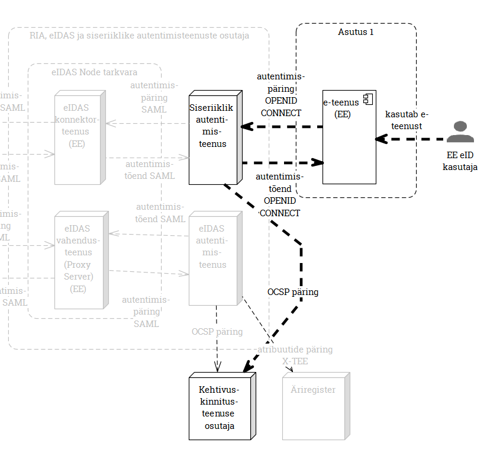

## Ülevaade

Käesolev dokument annab ülevaate RIAs arendatavatest autentimisteenustest. Hõlmatud on nii siseriiklikud kui ka piiriülesed (eIDAS) teenused. Iga teenus on kirjeldatud profiiliga, mis sisaldab:
a) teenuse identifikaatorit (koodnimetust); b) lühinimetust; c) täispikka nimetust; d) alternatiivnimetusi; e) sihtrühma lühikirjeldust; f) MUST/NICE TO HAVE liigitust; g) teenuse kasutusvoo ülevaatlikku kirjeldust; h) standardeid ja tehnoloogiaid (märksõna tasandil); i) kõrgvaatelist arhitektuurijoonist; j) teenuse olulisi omadusi (märksõna tasandil).

| Id | lühinimetus | nimetus | alternatiiv-nimetused | sihtrühm | MUST/NICE |
|:---:|:---------:|:-----------:|:-------:|:--------:|
|  1   | "eIDAS väljaminev" (_eIDAS outbound_) | eIDAS autentimispäringute vahendusteenus välisriikidesse | RIA eIDAS Node | Eesti asutus, kes tahab e-teenust pakkuda välisriigi eID kasutajale | eIDAS MUST |
|  2   | "eIDAS sissetulev" (_eIDAS inbound_)  | välisriikidest saabuvate eIDAS autentimispäringute täitmise teenus | RIA eIDAS Node | välisriigi asutus, kes soovib Eesti eID kasutajale osutada e-teenust, välisriigi eIDAS konnektorteenuse kaudu | eIDAS MUST |
|  3   | eIDAS konnektorteenus | eIDAS konnektorteenus Eesti asutusele | RIA eIDAS Node | välis-eID kasutajaid teenindav Eesti asutus, kes eelistab Eesti eIDAS konnektorteenusega liidestuda otse (nt RIK) | eIDAS mugavus |
|  4   | SSO teenus | Ühekordse sisselogimise teenus |  | Eesti e-teenuse osutaja, kes soovib, et teabeväravast eesti.ee suunatakse kasutaja e-teenusesse autenditult; Eesti asutused, kes soovivad födereerunult pakkuda Eesti eID kasutajale SSO kasutajakogemust | MUST (Eesti) |
|  5   | Siseriiklik autentimisteenus | Eesti e-teenust Eesti eID-ga kasutava inimese autentimise teenus | isikutuvastusportaal, elektrooniline isikutuvastusportaal, eesti.ee autentimisteenus, RIA autentimisteenus | e-teenust pakkuv Eesti asutus, kes Eesti eID kasutaja autentimist eelistab teenusena sisse osta |  mugavus (Eesti) |

## eIDAS autentimispäringute vahendusteenus välisriikidesse

## Välisriikidest saabuvate eIDAS autentimispäringute täitmise teenus

## eIDAS konnektorteenus Eesti asutusele

## Ühekordse sisselogimise teenus

## 5 Siseriiklik autentimisteenus

***Teenuse kasutusvoog:*** 1. Eesti eID kasutaja soovib sisse logida Eesti asutuse e-teenusesse; 2. Kasutaja suunatakse "isikutuvastusportaali", kus ta autenditakse; 3. Autenditud kasutaja suunatakse tagasi e-teenusesse.

***Standardid ja tehnoloogiad:*** ´OpenID Connect´ protokoll.

***Arhitektuurijoonis:***

