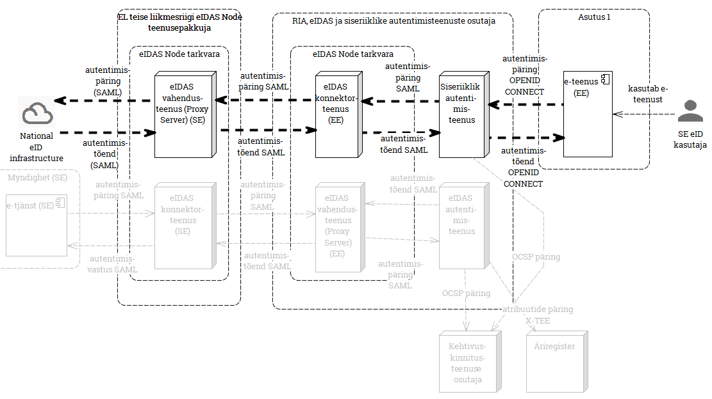
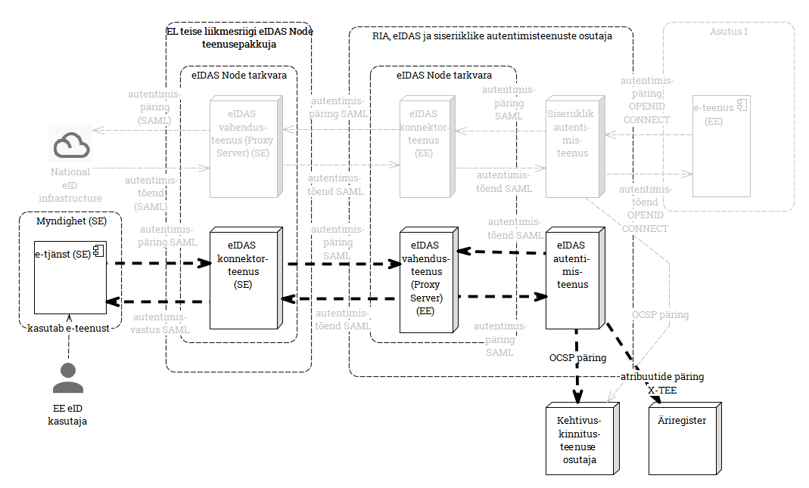
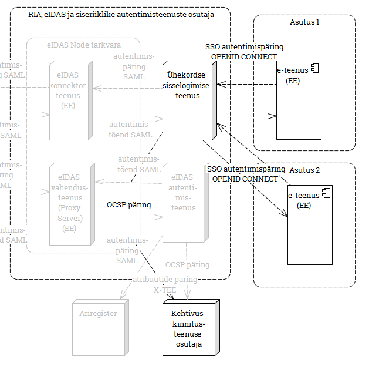

# Teenuseprofiilid

Käesolev dokument esitab RIAs arendatavate autentimisteenuste (siseriiklike kui ka piiriüleste) teenuseprofiilid (teatmelised lühikirjeldused).

Tabelis esitatakse iga teenuse identifikaator (koodnimetus), lühi- ja täispikk nimetus, võimalikud  alternatiivnimetused, sihtrühma lühikirjeldus ja MUST/NICE TO HAVE liigitus.

Iga teenuse kohta eraldi esitatakse teenuse kasutusvoo ülevaatlik kirjeldus, kasutatavate standardite ja tehnoloogiate loetelu ja kõrgvaateline arhitektuurijoonist.

| Id | lühinimetus | nimetus | alternatiiv-nimetused | sihtrühm | MUST/NICE |
|:---:|:---------:|:-----------:|:-------:|:--------:|
|  1   | eIDAS väljaminev | eIDAS autentimispäringute vahendusteenus välisriikidesse | RIA eIDAS Node | Eesti asutus, kes tahab e-teenust pakkuda välisriigi eID kasutajale | eIDAS MUST |
|  2   | eIDAS sissetulev | välisriikidest saabuvate eIDAS autentimispäringute täitmise teenus | RIA eIDAS Node | välisriigi asutus, kes soovib Eesti eID kasutajale osutada e-teenust, välisriigi eIDAS konnektorteenuse kaudu | eIDAS MUST |
|  3   | eIDAS konnektorteenus | eIDAS konnektorteenus Eesti asutusele | RIA eIDAS Node | välis-eID kasutajaid teenindav Eesti asutus, kes eelistab Eesti eIDAS konnektorteenusega liidestuda otse (nt RIK) | eIDAS mugavus |
|  4   | SSO teenus | Ühekordse sisselogimise teenus |  | Eesti e-teenuse osutaja, kes soovib, et teabeväravast eesti.ee suunatakse kasutaja e-teenusesse autenditult; Eesti asutused, kes soovivad födereerunult pakkuda Eesti eID kasutajale SSO kasutajakogemust | MUST (Eesti) |
|  5   | Siseriiklik autentimisteenus | Eesti e-teenust Eesti eID-ga kasutava inimese autentimise teenus | isikutuvastusportaal, elektrooniline isikutuvastusportaal, eesti.ee autentimisteenus, RIA autentimisteenus | e-teenust pakkuv Eesti asutus, kes Eesti eID kasutaja autentimist eelistab teenusena sisse osta |  mugavus (Eesti) |

## 1 eIDAS autentimispäringute vahendusteenus välisriikidesse

***Teenuse kasutusvoog:*** 1. Välisriigi eID kasutaja soovib kasutada Eesti asutuse e-teenust. 2. Suunatakse RIA "isikutuvastusportaali", kus valib riigi, mille eID-d ta kasutab. 3. RIA "isikutuvastusportaalist" suunatakse eIDAS konnektorteenuse vahendusel välisriigi eIDAS vahendusteenusesse, sealt edasi välisriigi rahvuslikku identiteeditaristusse, kus kasutaja autenditakse. 4. Autentimistõend liigub sama teed pidi tagasi Eesti e-teenusesse. 5. Autenditud kasutaja alustab Eesti e-teenuse kasutamist.

***Standardid ja tehnoloogiad:*** Eesti e-teenusega liides OpenID Connect-ga; välisriigi eIDAS vahendusteenuse osutajaga liidest SAML-põhise eIDAS protokolliga.

***Arhitektuurijoonis:***

## 2 Välisriikidest saabuvate eIDAS autentimispäringute täitmise teenus

***Teenuse kasutusvoog:*** 1. Eesti eID kasutaja soovib tarbida välisriigi e-teenust. 2. Välisriigi e-teenus suunab kasutaja läbi välisriigi eIDAS konnektorteenuse ja Eesti eIDAS vahendusteenuse RIA eIDAS autentimisteenusesse, kus toimub Eesti eID kasutaja autentimine. 3. Autentimistõend liigub sama teed pidi tagasi. 4. Autenditud kasutaja alustab välisriigi e-teenuse kasutamist.

***Standardid ja tehnoloogiad:*** SAML-põhine eIDAS protokoll.

***Arhitektuurijoonis:***

## 3 eIDAS konnektorteenus Eesti asutusele

***Teenuse kasutusvoog:***  1. Välisriigi eID kasutaja soovib kasutada Eesti asutuse e-teenust. 2. e-teenus suunab kasutaja eIDAS konnektorteenuse vahendusel välisriigi eIDAS vahendusteenusesse, sealt edasi välisriigi rahvuslikku identiteeditaristusse, kus kasutaja autenditakse. 4. Autentimistõend liigub sama teed pidi tagasi Eesti e-teenusesse. 5. Autenditud kasutaja alustab Eesti e-teenuse kasutamist.

***Olulised jooned:*** Erinevusena teenusest 1 ühendub Eesti e-teenus mitte "isikutuvastusportaali", vaid otse eIDAS konnektorteenuse külge.

***Standardid ja tehnoloogiad:*** e-teenus peab teostama konnektorteenuse SAML-põhise protokolli. 

***Arhitektuurijoonis:***

## 4 Ühekordse sisselogimise teenus

***Teenuse kasutusvoog:*** a) 1. Eesti eID kasutaja logib sisse ühes Eesti e-teenuses; 2. Kasutaja liigub teise e-teenusesse või avab selle paralleelselt esimesega. 3. Teise teenusesse sisselogimisel ei ole vaja uuesti autentida. 4. Kasutaja logib välja ühest e-teenusest. Sellega logitakse ta välja kõigist e-teenustest (_Single Sign-Off_).

***Olulised jooned:***
- Teenusega liitunud asutused moodustavad nn usaldusföderatsiooni (_Federated Identity_). Vastavad äriloogika ja -turvaküsimused vajavad tähelepanu. Vrdl [NIST Draft Special Publication 800-63C. Digital Identity Guidelines. Federation and Assertions](https://pages.nist.gov/800-63-3/sp800-63c.html) (May 2017).
- sisaldab ka ühekordse väljalogimise võimalust (_Single Sign-Off_).

***Standardid ja tehnoloogiad:*** ´OpenID Connect´ protokoll.

***Arhitektuurijoonis:***

## 5 Siseriiklik autentimisteenus

***Teenuse kasutusvoog:*** 1. Eesti eID kasutaja soovib sisse logida Eesti asutuse e-teenusesse; 2. Kasutaja suunatakse "isikutuvastusportaali", kus ta autenditakse; 3. Autenditud kasutaja suunatakse tagasi e-teenusesse.

***Standardid ja tehnoloogiad:*** ´OpenID Connect´ protokoll.

***Arhitektuurijoonis:***

