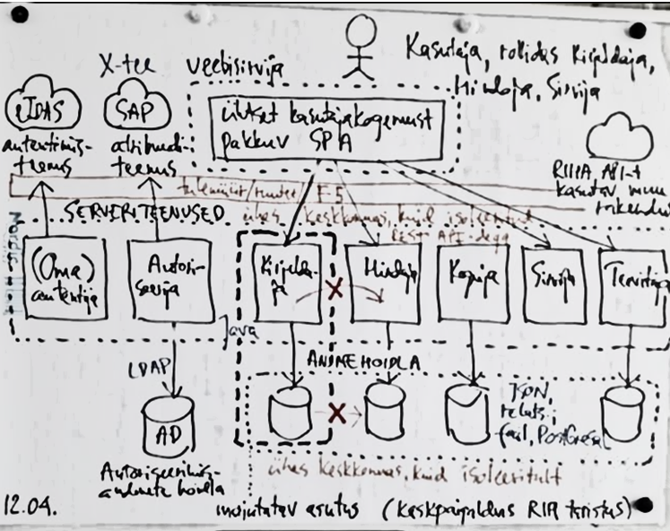

# Kesksüsteem

Joonis kujutab RIHA kesksüsteemi ülesehitust.

__Inimkasutaja__ suhtleb RIHAga veebisirvija vahendusel. Inimkasutaja:
- võib tegutseda mitmes rollis: `Kirjeldaja`, `Hindaja`, `Sirvija`
- võib olla autentimata või autenditud.

__Kasutajarakendus__. Veebisirvijas töötav RIHA kliendipoolne rakendus:
- pakub ühtset kasutajakogemust, võimalust liikuda sujuvalt erinevate vaadete ja rollide vahel
- võimalust avada kliendirakendust või selle osi mitmes sirvimiskontekstis (sakis).

Kasutajarakendus teostatakse üheleherakenduse (ingl _SPA, single page application_) põhimõttel (ei pea olema absoluutne SPA).

__Serveriteenused__ on RIA taristusse paigaldatud rakenduste - serverikomponentide - poolt pakutavad HTTPS REST API teenused. Serveriteenuseid tarbivad:
- veebisirvijas töötavad RIHA kasutajarakendused
- muud võimalikud RIHA API-t kasutavad rakendused.

Üksteise serveriteenuseid kasutavad ka serverikomponendid omavahel.

__Isoleerimine__. Serverikomponendid võivad olla paigaldatud ühte keskkonda (Apache veebiserverisse), kuid on loogiliselt iseseisvad ja suhtlevad üksteisega ainult HTTPS REST API-de kaudu.

Serverikomponentide hulka kuuluvad (nimekiri võib täieneda):
- __Autentija__ - korraldab ja teostab autentimist, kasutades kas oma autentimisprotseduuri (ID-kaardiga autentimine Apache veebiserveri abil) või välist eIDAS-autentimisteenust; vt [Autentimine](Autentimine)
- __Autoriseerija__ - autoriseerib autenditud kasutaja, kasutades kas kohapealset Autoriseerimisandmete hoidlat ja/või SAP atribuuditeenust (vt [Liides SAP-ga](LiidesSAPga)); vt [Autoriseerimine](Autoriseerimine)
- __Kirjeldaja__; vt [Kirjeldaja](Kirjeldaja)
- __Hindaja__; vt [Hindaja](Hindaja)
- __Koguja__; vt [Koguja](Koguja)
- __Sirvija__; vt [Sirvija](Sirvija)
- __Teavitaja__; vt [Teavitused](Teavitused).

__Andmehoidla__ eesmärk on RIHA kui süsteemi oleku (ingl _state_) hoidmine. Andmehoidla moodustavad kirjeldused, hinnangud, teavitused jm andmed. Andmeid hoitakse JSON, YAML vm masintöödeldavas vormingus, vajadusel relatsioonilise andmebaasina. Andmed võivad asuda ühises keskkonnas (failisüsteem, PostgreSQL andmebaas), kuid on loogiliselt eraldihoitud selles mõttes, et igal serverikomponendil on oma andmed, millele teine serverikomponent pääseb ligi ainult pöördumisega omanikkomponendi API poole.

__Autoriseerimisandmete hoidla__ ülesanne on hoida teavet isikutele omistatud rollide kohta. Autoriseerimisandmete hoidla teostatakse Active Directory (AD) tarkvaraga.

