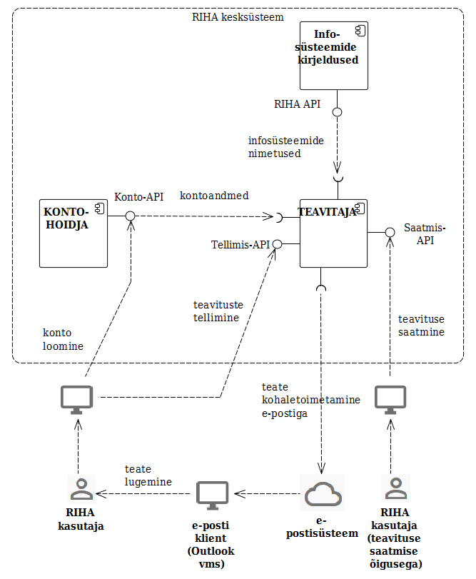

# Teavitused

RIHA teavitus on isiku e-postile saadetav teade RIHA-s toimuvast olulisest sündmusest.

RIHA teavitused on avalikud.

Igaühel on võimalik tellida RIHA teavitusi oma e-posti aadressile.

RIHA teavituste masintöötlemine lisaväärtust pakkuvate rakenduste loomisel ei ole keelatud.

Teavituste saatmise õigusega isikute ring on piiratud:
- RIA
- kooskõlastajad
- infosüsteemi omanik (infosüsteemiga seotud kasutajatele).

Teavitusi saavad saata ka tarkvarakomponendid, vastavate sündmuste tekkimisel.

Teavitused võivad olla inimese algatatud või sündmusest tekkivad.

Teavitused saadetakse e-postile.

Teavitused on eraldi tarkvarakomponentide vahelisest REST API HTTPS sõnumiliiklusest.

RIHA haldamise, statistika ja turvalisuse eesmärgil teavitusi logitakse.

## Protsess

__kasutajakonto loomine__ - Inimene (ei pea olema avaliku sektori töötaja) autentib end ID-kaardiga, teatab oma e-posti aadressi. Sellega on RIHA kasutajakonto loodud.

__teavituste tellimine__ - Autenditud kasutaja, kellel on RIHA kasutajakonto (vt eelmine punkt), valib teavituste tüübid ja/või infosüsteemid, mille kohta soovib teavitusi saada.

__teavituse koostamine__ - Autenditud kasutaja, kellel on teavituse saatmise õigus, sisestab teavituse teksti, määrab teavituse tüübi (valikuline) ja ühe või mitu adressaati.

__teavituse kohaletoimetamine__ - Teavitus saadetakse adressaatide e-postile.

## Teostus

Teavitamine teostatakse põhiliselt kahe komponendi abil:

__KONTOHOIDJA__ - hoiab kasutajate identiteete ja rolle (isikukood, nimi, e-posti aadress, milliste infosüsteemide osas omab teavituste saatmise õigust, kas omab üldist teavituste saatmise õigust); API kaudu võimaldab kontosid ja luua ja kontoandmeid pärida.

__TEAVITAJA__ – võimaldab teavitusi tellida ja teavitusi saata (Tellimis-API ja Saatmis-API).

