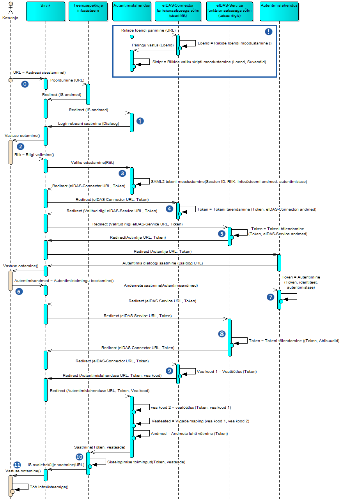

# eIDAS konnektorteenus. Liidestumisjuhend

## Ülevaade

***eIDAS konnektorteenus***, edaspidi ka _teenus_, on RIA poolt käitatav taristuteenus, mis võimaldab Eesti asutuse autentimisteenusel teostada EL teise liikmesriigi eID kasutaja autentimist. Tehniliselt teostab teenust RIA taristusse paigaldatud eIDAS Connector servertarkvara, mis liidestatakse ühelt poolt asutuse autentimisrakendusega ja teiselt poolt EL teiste riikide eIDAS taristutega.

Käesolev juhend esitab teenuse kasutuselevõtmiseks vajalikud tööd ja teabe.

## Mõisted

***eIDAS konnektorteenus*** - RIA poolt käitatav taristuteenus, mis võimaldab Eesti asutuse autentimisteenusel teostada EL teise liikmesriigi eID kasutaja autentimist. 

***autentimislahendus*** - asutuse poolt käitatav tarkvarakomponent, mis korraldab asutuse e-teenuse kasutaja (kes võib olla nii Eesti kui ka EL teise liikmesriigi eID kasutaja) isikusamasuse tuvastamist, suheldes selleks eIDAS konnektorteenusega.

***asutus*** - eIDAS konnektorteenust kasutav asutus.

## Teenuse kasutusvoog

```
                           autentimispäring
                               (SAML)
  ,+.
  `|'        +---------------        +---------------+
  /|\        |    Asutuse    +---->  |     eIDAS     |       EL
   +         |  autentimis-  |       |   konnektor-  |      eIDAS-
  / \        |    lahendus   |  <----+     teenus    |     taristu
             +---------------+       +---------------+
KASUTAJA
                          autentimisvastus
                               (SAML)
```

eIDAS konnektorteenus on ühendajaks asutuse autentimislahenduse ja EL eIDAS-taristu vahel.

## Tööd

Liidestumiseks tuleb teostada järgmised tööd:

|    |  Asutus | RIA |
|----------------------------------|:------------:|:---------------:|
|  1  Autentimislahenduse tarkvara loomine või täiendamine |  +  |   |
|  2  Autentimislahenduse paigaldamine | + |   |
|  3  Autentimislahenduse häälestamine
ühendumiseks RIA-s asuva eIDAS Connector
serveriga | + | + |
| 4 Liidese testimine | + | + |
| 5 Liidese käikulaskmine | + | + |

## Vahetatavad sõnumid

Autentimislahenduse ja eIDAS konnektorteenuse vaheline suhtlus on osa eIDAS autentimisvoost (vt lisa 1), hõlmates sellest kahte sõnumisaatmist:

- autentimispäringut esitava SAML tõendi (_token_) saatmine autentimislahendusest eIDAS konnektorteenusele (joonisel lisas 1 nr 4);
- autentimisvastust esitava SAML tõendi saatmine eIDAS konnektorteenuselt autentimislahendusele (joonisel lisas 1 nr 9).

Sõnumisaatmise teostatakse veebisirvija ümbersuunamise (_redirect_) abil.


## Taustateave

[] Riigi Infosüsteemi Amet (2016) eIDAS Node arhitektuur.

## Lisa 1 eIDAS autentimisvoog




