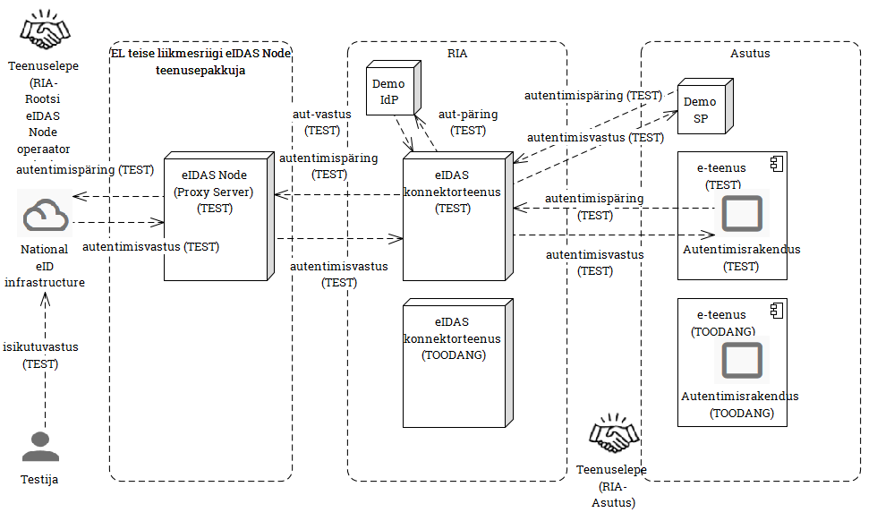

# Liidestumisjuhend
{:.no_toc}

versioon 1.0, 30.05.2017

* TOC
{:toc}

## 1 Ülevaade

_eIDAS konnektorteenus_, edaspidi ka _teenus_, on RIA poolt käitatav taristuteenus, mis võimaldab Eesti asutuse autentimisrakendusel autentida EL teise liikmesriigi eID kasutajat.

Tehniliselt teostab teenust RIA taristusse paigaldatud _eIDAS Connector servertarkvara_, mis liidestatakse ühelt poolt asutuse autentimisrakendusega ja teiselt poolt EL teiste riikide eIDAS taristutega.

Käesolev juhend on suunatud teenust kasutavale asutajale ja esitab teenuse kasutuselevõtmiseks vajaliku teabe ja tööd.

## 2 Mõisted

_eIDAS konnektorteenus_ - RIA poolt käitatav taristuteenus, mis võimaldab Eesti asutuse autentimisteenusel teostada EL teise liikmesriigi eID kasutaja autentimist. 

_autentimisrakendus_ - asutuse poolt käitatav tarkvarakomponent, mis korraldab asutuse e-teenuse kasutaja (kes võib olla nii Eesti kui ka EL teise liikmesriigi eID kasutaja) autentimist (isikusamasuse tuvastamist), suheldes selleks eIDAS konnektorteenusega.

_asutus_ - eIDAS konnektorteenust kasutava autentimisrakenduse omanikasutus.

## 3 Tehniline ülevaade

## 3.1 Teenuse kasutusvoog

```
                           autentimispäring
                               (SAML)
  ,+.
  `|'        +---------------        +---------------+
  /|\        |    Asutuse    +---->  |     eIDAS     |       EL
   +         |  autentimis-  |       |   konnektor-  |      eIDAS-
  / \        |    lahendus   |  <----+     teenus    |     taristu
             +---------------+       +---------------+
KASUTAJA
                          autentimisvastus
                               (SAML)
```

eIDAS konnektorteenus on ühendajaks asutuse autentimisrakenduse ja EL eIDAS-taristu vahel.

Autentimisrakenduse ja eIDAS konnektorteenuse vaheline suhtlus on osa eIDAS autentimisvoost (vt lisa 1), hõlmates sellest kahte sõnumiedastust:

- autentimispäringut esitava SAML tõendi (_token_) saatmine autentimisrakendusest eIDAS konnektorteenusele (vt joonisel lisas 1 sõnumiedastus nr 4);
- autentimisvastust esitava SAML tõendi saatmine eIDAS konnektorteenuselt autentimisrakendusele (vt joonisel lisas 1 sõnumiedastus nr 9).

Sõnumiedastus teostatakse veebisirvija ümbersuunamise (_Re-direct_) abil.

## 3.2 Tehniline spetsifikatsioon

Sõnumivahetus autentimisrakenduse ja eIDAS konnektorteenuse vahel teostatakse vastavalt eIDAS tehnilisele spetsifikatsioonile v 1.1 [eID eIDAS profile]. Vt jaotis "Normatiivdokumendid".

Vahetatavad sõnumid ja nende töötlusreeglid peavad vastama eIDAS nõuetele, vastavalt spetsifikatsioonides "eIDAS SAML Message Format" (v 1.1) [eIDAS Message Format] ja "eIDAS SAML Attribute Profile" (v 1.1) [eIDAS Attribute Profile] määratletule.  

## 3.3 Normatiivdokumendid

Käesoleva jaotise dokumentidega tutvumine ja nende järgimine autentimisrakenduse liidese mõlemas otsas on kohustuslik.

Märkus. Euroopa Komisjoni CEF veebisüsteem on muutmisel (mai 2017). Seetõttu võivad mõned viited tulevikus vajada ajakohastamist.

[eID eIDAS profile] European Commission. ***eID eIDAS profile***. [https://ec.europa.eu/cefdigital/wiki/display/CEFDIGITAL/eID+eIDAS+profile](https://ec.europa.eu/cefdigital/wiki/display/CEFDIGITAL/eID+eIDAS+profile). Technical specifications.

[eIDAS SAML Attribute Profile] ***eIDAS SAML Attribute Profile***. [https://ec.europa.eu/cefdigital/wiki/display/CEFDIGITAL/eID+eIDAS+profile?preview=/23003348/35218928/eIDAS%20SAML%20Attribute%20Profile%20v1.1_2.pdf](https://ec.europa.eu/cefdigital/wiki/display/CEFDIGITAL/eID+eIDAS+profile?preview=/23003348/35218928/eIDAS%20SAML%20Attribute%20Profile%20v1.1_2.pdf).

[eIDAS SAML Message Format] ***eIDAS SAML Message Format***. [https://joinup.ec.europa.eu/sites/default/files/eidas_message_format_v1.0.pdf](https://joinup.ec.europa.eu/sites/default/files/eidas_message_format_v1.0.pdf).

## 4 Teenusega liitumine

Teenuse kasutuselevõtmiseks esitab asutus RIA-le sooviavalduse eIDAS konnektorteenuse kasutamiseks.

Lepitakse kokku kontaktisikud ja tehakse kindlaks, et tehnilistest küsimustest saadakse õigesti aru. RIA nõustab liidestamise tehnilistes küsimustes.

Autentimisrakenduse arendusega paralleelselt valmistatakse ette testiplaan. Testiplaan kinnitatakse RIA ja asutuse poolt. 

Testide eduka täitmise järel võtakse teenus toodangukeskkonnas kasutusele. Teenuse kasutamise aluseks on teenuslepe.

## 5 Liidestamistööd

Liidestamiseks tuleb teostada järgmised tööd:

|            |  Asutus     | RIA               |
|---------|:------------:|:---------------:|
|  1  Autentimisrakenduse tarkvara loomine või täiendamine |  +  |   |
|  2  Autentimisrakenduse paigaldamine ja häälestamine ühendumiseks RIA-s asuva eIDAS Connector serveriga | + |   |
| 3 Liidese testimine | + | + |
| 4 Liidese käikulaskmine | + | + |

## 5.1 Autentimisrakenduse tarkvara loomine või täiendamine

Teenusest arusaamist võib hõlbustada demorakendusega tutvumine. Demorakenduses saab läbi mängida kasutaja autentimisvoo. Demorakenduse lähtekoodi koos dokumentatsiooniga saab alla laadida CEF veebilehelt (demo SP) [eIDAS Node tarkvara].

Tutvuda saab ka RIAs ülespandud demorakendusega, selle URL on:

`https://eidastest.eesti.ee/SP/populateIndexPage`

## 5.2 Autentimisrakenduse seadistamine

Testimiseks kasutatakse eIDASe konnektorteenuse testinstantsi. Testimise autentimispäringuid vastuvõtva teenusepunkti URL on: 

`https://eidastest.eesti.ee/EidasNode/ServiceProvider`

Autentimisrakendus ja teenus suhtlevad sertifikaatide abil. Seadistamiseks vajaliku teabe, sh  võtmete vahetamiseks pöörduda RIA poole.

## 5.3 Liidese testimine

Liidest testitakse kahes etapis:

- demo-identiteedipakkuja abil testimine (kohustuslik), vt jaotis 5.5;
- _end-to-end_ testimine (kohustuslik), vt jaotis 5.6.

Lisaks võib asutus soovi korral testida konnektorteenusega ühendumist demoteenuse tarkvara abil (vt jaotis 5.4).

Testimise ülesehitust kirjeldab allolev joonis. Märkus. Arvestada, et autentimispäringud- ja autentimisvastused saadetakse kasutaja veebisirvija ümbersuunamise abil (_Re-direct_). 



Testimine tugineb RIA poolt paigaldanud eIDAS konnektorteenuse testinstantsi kasutamisele (joonisel _eIDAS konnektorteenus TEST_).

## 5.4 Demoteenuse abil testimine (valikuline)

Asutus võib soovi korral enne autentimisrakenduse arendust, tutvumise eesmärgil paigaldada enda taristusse demoteenuse rakenduse (joonisel _Demo SP_, _Demo Service Provider_). Demoteenus on eIDAS Node tarkvaraga komplektis EL CEF poolt tarnitav, eraldi paigaldatav rakendus, mis mängib läbi kasutajale pakutavat e-teenust ja selle autentimisrakendust (veebileht, kuhu kasutaja e-teenuse saamiseks pöördub ja kus algab autentimine). Demoteenuse kasutamisel vahetavad asutus ja RIA  seadistusteavet (ühenduspunktide aasdressid, serdid) ja ühendus demoteenuse ja RIA eIDAS konnektorteenuse vahel testitakse testsõnumite saatmisega.

## 5.5 Demo-identiteedipakkuja abil testimine (kohustuslik)

Asutus arendab autentimisrakenduse ja paigaldab selle testinstantsi (joonisel _Autentimisrakendus TEST_). Asutus ja RIA vahetavad seadistusteavet (ühenduspunktide aasdressid, serdid). Konnektorteenuse ja autentimislahenduse vahelist ühendust testitakse testsõnumite saatmisega. Selleks pakub RIA oma taristusse paigaldatud demo-identiteedipakkuja kasutamise võimalust (joonisel _Demo IdP_, _Demo Identity Provider_). Demo-identiteedipakkuja on eIDAS Node tarkvaraga komplektis EL CEF poolt tarnitav, eraldi paigaldatav rakendus, mis mängib läbi kasutaja isikutuvastamist (5-6 väljamõeldud liikmesriigis).

## 5.6 end-to-end testimine

Demo-identiteedipakkuja testide eduka läbimise järel teostatakse _end-to-end_ testimine vähemalt ühe teise EL liikmesriigi eID taristu vastu. eIDAS Node-e käitlevad liikmesriikide institutsioonid moodustavad nn eIDAS "föderatsiooni" ja pakuvad üksteisele võimalust piiriülest autentimist testida (eIDAS testteenused).

- RIA selgitab välja eIDAS Node testiteenuseid pakkuvad liikmesriigid (liikmesriikide võimekus erineb ning tekib aja jooksul), loob nendega kontaktid, sõlmib testimiseks vajalikud kokkulepped ja ühendab RIA eIDAS Node-i tehniliselt testimisel osalevate liikmesriikide eIDAS Node-dega.

- _end-to-end_ testimine teostatakse testsõnumite saatmisega - ja kokkuleppel ka inimtestijate kasutamisega. Testitakse kõik olulised kasutuslood, positiivsed ja negatiivsed stsenaariumid. Enne testimist koostatakse testiplaan, milles määratletakse testilood, testiandmed ja testimises osalevate asutuste konkreetset kohustused. Testiplaan kinnitatakse RIA poolt. 

## 5.7 Liidese käikulaskmine

Teenuse avamiseks toodangukeskkonnas peab teenus olema testitud. Toodangukeskkonnas suhtlevad autentimisrakendus ja teenus sertifikaatide abil. Sertifikaatide vahetamiseks pöörduda RIA poole.

## 6 Teatmelised dokumendid

Käesoleva jaotise dokumendid ja tarkvara võivad olla kasulikud teenusest ja selle kontekstist paremaks arusaamiseks ning autentimisrakenduse arenduses. Kuid tutvumine ja kasutamine ei ole tingimata vajalik.

[eIDAS Node arhitektuur] Riigi Infosüsteemi Amet (2016) ***eIDAS Node arhitektuur***. Tutvumiseks pöörduda RIA poole.

[eIDAS Node tarkvara] European Commission. ***eIDAS-Node***. [https://ec.europa.eu/cefdigital/wiki/display/CEFDIGITAL/eIDAS-Node](https://ec.europa.eu/cefdigital/wiki/display/CEFDIGITAL/eIDAS-Node).

<div style="margin-bottom: 4rem;">&nbsp;</div>

## LISA 1 eIDAS autentimisvoog

Allolev joonis esitab eIDAS autentimisvoo. Lähemalt vt [eIDAS Node arhitektuur].


