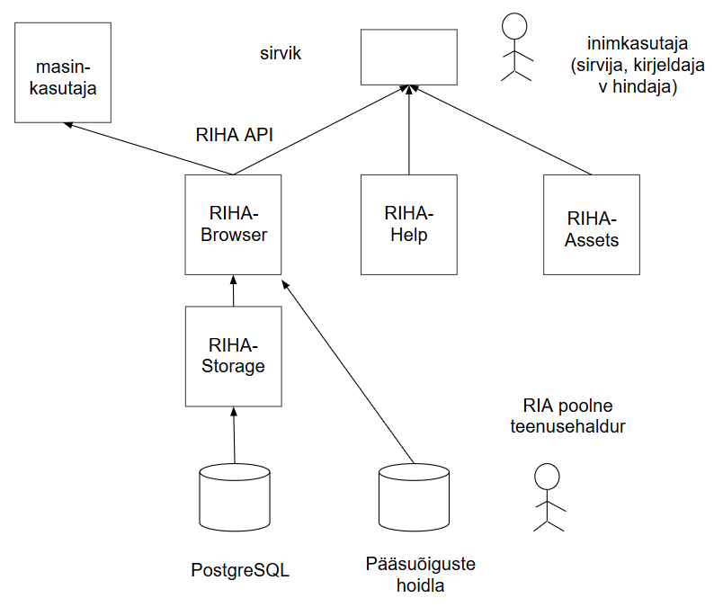

# Arhitektuurikirjeldus
{: .no_toc}

- TOC
{:toc}

## Ülevaade 

Käesolev dokument kirjeldab RIHA ja selle vahetu ümbruse:
- osapooled ja komponendid
- teenused ja liidesed
- tähtsamad arhitektuurilised valikud ja eesmärgid
- olulisemad sõltuvused
- käideldavuse ja turvalisuse aspektid.

### Arhitektuurijoonis



## Teenused

RIHA pakub riigi infosüsteemi kataloogiteenust:
- kataloog hõlmab infosüsteeme ja X-tee alamsüsteeme
- süsteemikirjelduste sirvimine
- süsteemi kirjeldamine
- süsteemikirjelduste pakkumine masinliidese (API) kaudu
- hindajate tagasiside
- lisaks pakutakse "RIHA varamu" nime all asutustevahelise dokumendivahetuslahenduse metaandmekirjeldusi.

Vt lähemalt:
- [Infosüsteemide kirjeldamine RIHA-s](https://abi.riha.ee/RIHAs-kirjeldamine) (abikeskuse tekst)
- [Kuidas muuta X-tee alamsüsteemi andmeid RIHAs?](https://abi.riha.ee/X-tee-alamsysteem).

### Masinliides

- RIHA arendatakse põhimõttel, et kõik kogutavad andmed peavad olema kättesaadavad masinliidese (API) kaudu.
- Enamgi veel, kasutaja poolt sirvikus sisestatud andmed kantakse andmehoidlasse samuti API kaudu.
- Masinliides on JSON RESTful vormingus.
- Masinliides kirjeldatakse OpenAPi (Swagger) vormingus. 

Vt:
- [RIHA masinliides](https://abi.riha.ee/APIabi) (abikeskuse tekst).

## Komponendid ja osapooled

### Organisatsioonid

- Riigi Infosüsteemi Amet (RIA) - haldab ja arendab RIHA.
- infosüsteemi omanik - asutus, X-tee alamsüsteemi korral ka ettevõte jm organisatsioon, RIHA kirjeldatud süsteemi omanik.
- hindaja - asutus, kes hindab infosüsteemi vastavust nõuetele.

### Inimesed

- kasutaja - RIHA kasutaja, ei pea olema autenditud.
- kirjeldaja - asutuse vm organisatsiooni töötaja, kes kirjeldab RIHAs infosüsteemi.
- hindaja - hindava asutuse töötaja, kes hindab RIHAs kirjeldatud infosüsteemi vastavust nõuetele.

### Tuumkomponendid

komponent | avalik URL                                       | repo | funktsioon
----------|:--------------------------------------------:|:----:|-------
Abikeskus | [https://abi.riha.ee](https://abi.riha.ee) | [https://github.com/e-gov/RIHA-Help](https://github.com/e-gov/RIHA-Help) | annab kasutajale abiteavet RIHA kasutamise kohta
RIHA-Browser |  | [https://github.com/e-gov/RIHA-Browser](https://github.com/e-gov/RIHA-Browser) | RIHA _front-end_, sirvikus käitatav üheleherakendus
RIHA-Storage | [https://www.riha.ee/api/v1](https://www.riha.ee/api/v1) | [https://github.com/e-gov/RIHA-Storage](https://github.com/e-gov/RIHA-Storage) | RIHA andmehoidla, teenindab oma API kaudu RIHA teisi serveriteenuseid ja laiema "ökosüsteemi" masinkasutajaid, vahendaja PostgreSQL andmebaasi ja HTTPS päringute vahel
RIHA-Assets | [https://varamu.riha.ee/](https://varamu.riha.ee/) | [https://github.com/e-gov/RIHA-Assets](https://github.com/e-gov/RIHA-Assets) | veebirakendus, mille kaudu tehakse avalikult kättesaadavaks asutustevahelises dokumendivahetuses kasutatavad varad ja ajutiselt (kuni klassifikaatorite mooduli valmimiseni) ka osad klassifikaatorid
Pääsuõiguste hoidla | - | - | sisekomponent kirjeldajate ja hindajate pääsuõiguste hoidmiseks, suhtlus pääsuõiguste hoidlaga toimub LDAP protokolliga 

### Arendust toetavad komponendid

komponent | avalik URL                                       | repo | funktsioon
----------|:--------------------------------------------:|:----:|-------
RIHA-Index | [https://arhitektuur.riha.ee](https://arhitektuur.riha.ee) | [https://github.com/e-gov/RIHA-Index](https://github.com/e-gov/RIHA-Index) | RIHA arhitektuurikirjeldus
RIHA-Frontend | [https://e-gov.github.io/RIHA-Frontend](https://e-gov.github.io/RIHA-Frontend) | [https://github.com/e-gov/RIHA-Frontend](https://github.com/e-gov/RIHA-Frontend) | kasutajaliidese kujunduslahenduse prototüüp
RIHA-Experiments | | [https://github.com/e-gov/RIHA-Experiments](https://github.com/e-gov/RIHA-Experiments) | abirepo tehnoloogiate katsetamiseks

### "Ökosüsteemi" muud komponendid

komponent | avalik URL                                       | repo | funktsioon
----------|:--------------------------------------------:|:----:|-------
RIHA-Watch | [https://riha-watch.herokuapp.com/](https://riha-watch.herokuapp.com/) | [https://github.com/e-gov/RIHA-Watch](https://github.com/e-gov/RIHA-Watch) | kuvab viimase 10 päeva jooksul lisatud ja uuendatud infosüsteemid

## Arhitektuurilised valikud

### Andmete hoidmine

Andmebaasimootor. Kasutatakse uusimat Ubuntu LTS-s toetatud PostgreSQL versiooni. Alates versioonist 9.4 on PostgreSQL-l väga hea tugi vaba struktuuriga JSON andmete efektiivseks hoidmiseks ja töötlemiseks (`jsonb` tüüpi väljal).

Väljad esitatakse PostgreSQL `jsonb` tüüpi nimi-väärtus paaridest koosneva objektina, kus väärtused võivad olla nii lihtväärtused kui omakorda sisemise struktuuriga objektid või massiivid. Selline mahukas `jsonb` objekt on klassikalise SQL tabeli mõttes väljal `json_content`.

Igal uuel tabelil on lisaks `json_content` väljale veel mitmeid klassikalisi SQL välju, mille põhieesmärk on võimaldada kiiremat otsingut, ehk niiöelda puhverdatud väärtused.

Andmebaasi struktuur toetub kahele peamisele tabelile: ülemise taseme tabel `main_resource` ja tema komponentide tabel `data_object` ning neile lisainfot andvatele tabelitele `document` ja `comment`.

Lisaks on kasutusel objektitüüpide tabel `kind`.

Peamised täiendavat informatsiooni sisaldavad tabelid, mis võivad viidata mistahes `main_resource` või `data_object` reale, on:

`document` - sisaldab üldjuhul ametliku dokumendi (määruse vms) tervet sisu või tema viita kas URLi või failisüsteemi viidana, samuti selle metainformatsiooni: nimi, kehtivusperiood jms.
- `comment` sisaldab mõne süsteemi kasutaja tekstilist kommentaari või küsimust konkreetse süsteemi või tema osa kohta, koos metainfoga: millal lisati jms.

Infosüsteemi kirjeldamine. Infosüsteem esitatakse `main_resource` tabelis. Välja `kind` väärtus on `infosystem`. Kirjelduse põhiosad esitakse `json_content` väljal, mis sisaldab mh ka kõiki ülaltoodud SQL-lauses antud klassikalisi välju.

Infosüsteemi püsiv, versioonist sõltumatu identifikaator on `uri`, kuhu sisestatakse üldjuhul `riha:infosystem:lühinimi` . Hierarhilise põhiobjekti korral viidatakse ülemobjektile `parent_uri` välja kaudu, millele lisandub sekundaarse võimalusena versioonitundlik `parent_id` juhuks, kui hierarhia versioneerimise käigus muutub.

### Infosüsteemi andmekoosseis

Infosüsteemi andmekoosseis kirjeldatakse vähemalt ärivaates. Andmekoosseisu kirjeldamine ka tehnilises vaates on soovitatav, kuid mitte kohustuslik.

Andmekoosseisu ärikirjeldus on suunatud infosüsteemis töödeldavate andmete sisulisele kirjeldamisele. Ärikirjeldus on suunatud inimesele, ülevaate saamiseks infosüsteemis hoitavatest andmetest. Ärikirjeldus antakse andmeobjekti, mahuka andmekoosseisu puhul aga andmeobjektide kategooria tasandil ja tavaliselt ei ületa 20..30 elementi. Andmeobjekti või -kategooria kirjeldus koosneb nimetusest ja selgitusest. Ärikirjeldus koostatakse eesti keeles, pöörates erilist tähelepanu täpsele terminoloogiale ja sõnastuste mõistetavusele. Ärikirjeldusi kasutatakse RIHA otsingus infosüsteemide liidestajate poolt.

Andmekoosseisu tehniline kirjeldus on infosüsteemis töödeldavate või hoitavate andmete detailne, otseselt töötlusega seotud kirjeldus, nt andmebaasi detailne skeem.

Tehniline kirjeldus esitatakse ühel järgmistest viisidest: 1) viitena failile; 2) faili üleslaadimisega; 3) viitena API-le.

Tehniline kirjeldus võib olla esitatud SQL andmekirjelduskeele (Data Definition Language) skriptina, CSV-failina või muus formaadis.

Tehniline kirjeldus on suunatud infosüsteemide tehnilisele integraatorile.

## Arhitektuurilised eesmärgid

### Kasutajakogemus

Inimkasutaja liides peab võimaldama sujuvad liikumist erinevate vaadete ja rollide vahel. Kujundamisel on aluseks [RIHA kujunduslahenduse prototüüp](https://github.com/e-gov/RIHA-Frontend).

### API kirjeldus

RIHA masinliidese (API) standardiseeritud, [formaalne kirjeldus](https://github.com/e-gov/RIHA-API/blob/master/RIHA-API.yaml) on koostatud vastavalt [Open API Initiative](https://www.openapis.org/) (endine Swagger) nõuetele.

### Kood

RIHA kood on avalik.

### URL-id

Kasutajaliidese URL-des järgitakse põhimõtteid:

- URL-id on inimkasutatavad: lühikesed, inimesele tähenduslikud, meeldejäävad
- URL-id võimaldavad otseteid (sisenemispunkte) nii kõigi suuremate toimingute (sirvimine, kirjeldamine, hindamine) kui ka toimingute objektide lõikes (asutused, infosüsteemid, hiljem ka muud)
- võimalik on kasutada paralleel-URL-e eesti ja inglise keeles
- infosüsteemidele ja asutustele saab viidata lühinimedega
- asutusele saab viidata ka registrikoodiga
- täpitähed esitatakse _URL encoded_ kujul.

### Andmekvaliteet

Andmekvaliteedi saavutamine on RIHAs üks suuremaid väljakutseid. Andmekvaliteeti ei ole võimalik saavutada ainuüksi tehniliste vahenditega. Vaja on ka organisatsiooni, protsessi(de) ja metoodika arendamist.

Selged nõuded. RIHA osaks on protsess, millega identifitseeritakse RIHAs kontrollitavad nõuded, tuuakse need nõuded RIHA kasutajatele ilmutatud kujul välja ja kontrollitakse nõuete põhjendatust ning selgust. 

Selge metoodika andmevälja täitmisel. Iga andmevälja täitmisel peab olema selge metoodika ja metoodika peab rakendusest olema kasutajale juhisena kättesaadav.

### "API first" põhimõte

Hajusalt paigaldatud komponendid, aga samuti ka kesksüsteemi serveriteenused ja veebisirvijas paiknev kasutajarakendus suhtlevad üksteisega REST API-de kaudu.

API-de kaudu pakutakse võimalikult kõike RIHAsse kogutavat teavet.

Kasutatakse _API first_ põhimõtet: kasutajaliideste ehitamisel tehakse samu andmeid töötlev API kas enne kasutajaliidest või vähemalt samaaegselt.

API-de kujundamisel lähtutakse [API-de disaini juhise](https://agiil.github.io/IT/API) põhimõtetest ja terminoloogiast.

## Sõltuvused

sõltuvus | versioon (kui on oluline) | komponent (eesliiteta RIHA-)
:-------:|:--------:|:---------:|
Angular  | 4        | Browser   |
Apache Maven | 3    | kõik Java komponendid |
Bootstrap | 4       | Browser, Help |
Bower    |          |           |
Java 1.8 | OpenJDK  | Browser, Storage, Assets |
Jekyll   |          | Help      |
Node.js  | 4        | kasutusel testimisel  |
OpenLDAP |          | Browser   |
PostgreSQL |        | Storage   |
npm      |          | kasutusel testimisel  |
Spring Boot |        | Browser, Storage |
Yarn     |          |           |
Ubuntu   | 16 LTS   |           | 

## Käideldavus ja turvalisus

### Isikuandmete töötlus

RIHAs töödeldakse ka vähesel määral isikuandmeid. Isikuandmeid on vaja kaitsta. Eelkõige tuleb tagada, et: 1) hoitakse eesmärkide saavutamiseks minimaalselt vajalikke andmeid; 2) ligipääs tundlikele või eraelulistele isikuandmetele on piiratud. Käesolev jaotis kirjeldab isikuandmete töötluse ja kaitse olulisi äriprotsessilisi ja tehnilisi meetmeid RIHAs.

Isiku rollid RIHAs. Füüsilised isikud suhtestuvad RIHAga järgmistes rollides:

- sirvija - kirjelduste sirvija
- kirjeldaja - kirjelduste koostaja - isik, kes omab RIHAs õigust kirjeldada asutuse infosüsteeme. Kirjeldaja peab olema asutuse töötaja
- hindaja (kooskõlastaja)
- kontaktisik - infosüsteemi vm RIHAs kirjeldatud vara kontaktisik – infosüsteemiga (hiljem ka muu RIHA objektiga, nt klassifikaatoriga) seotud isik, kellega võib ühendust võtta. Kui infosüsteemile ei ole määratud teist kontaktisikut, siis on kontaktisikuks viimane kirjeldaja. Kontaktisik võib olla seotud ka asutuse kõigi infosüsteemidega. Sellisel juhul nimetame teda asutuse RIHA kontaktisikuks.
- RIA poolne RIHA (teenuse)haldur.

Isikute kohta hoitavad andmed:
- sirvija - autentimine ei ole vajalik; logitakse RIHA talitluspidevuse tagamiseks vajalikke andmeid sirvija tegevuse kohta; logitud andmeid kasutatakse turvaintsidentide lahendamiseks ja RIHA kasutusstatistika tootmiseks (viimases isikuid mittetuvastaval viisil).
- kontaktisik - RIHA töödeldakse järgmisi kontaktisikute andmeid (edaspidi - kontaktandmed):
  - isikukood, nimi, asutuse nimetus, e-posti aadress, ametinimetus (valikuline), telefon (valikuline), infosüsteemi(de) nimetused
  - kontaktisiku tegevuste logi.
- kirjeldaja_ - Kirjeldajate kohta hoitakse RIHAs samu andmeid, mis kontaktisikute kohta.

Juurdepääs isikuandmetele RIHAs. Kontaktisik saab deklareerida oma andmed avalikult kättesaadavaks (kõik saavad RIHAs vaadata). Vaikimisi pääsevad kontaktandmetele ligi ainult asutuste töötajad. Kirjeldaja kohta näevad teavet ainult tema ise ja järgmised kirjeldajad.

Isikuandmete ajakohasuse tagamine. Edasiarendusvõimalus: _Päringuga üle X-tee riigi personali- ja palgaarvestuse andmekogusse (SAP) kontrollitakse, kas kirjeldaja ja kontaktisik on asutusega seotud. Seda kontrolli tehakse nii uute kirjeldajate ja kontaktisikute lisamisele kui ka perioodiliselt andmete ajakohasuses tagamiseks._

### Käideldavus

Mõisted:

failover
: _tõrkesiire_; _avarii-ümberlülitus_ - käideldavust suurendav automatiseeritud või käsiprotsess elastsete IT-teenuste ümberlülituseks, kasutades varuseadmeid, -asukohti ja/või -võrgumarsruute; siirdumine varuressursile 

fallback 
: 1) _taandeolek_ normaalset ajutiselt asendav (väiksemate võimalustega) varukonfiguratsioon või -tööviis;  2) _varuvariant_

scalability
: _mastaabitavus_, süsteemi omadus tulla ühtviisi toime väga suurte või väga väikeste koormustega, ilma et ta tõhusus- ja kvaliteedinäitajad oluliselt muutuksid; tavaliselt hõlmab ka laiendatavust

switchover
: sama, mis _failover_, kuid käsitsi

Tõrkekindluse saavutamise peamised meetodid on:

-  komponentstruktuur
- iga komponendi kohustus arvestada teise komponendi tõrketüüpidega ja neid võimaluste piires mõistlikult käsitleda (kinni püüda, avastada, mitte edasi anda kolmandatesse moodulitesse, saata monitooringumärguanne (Alert) jne)
- iga komponendi kohustus produtseerida oma tegevuse kohta logiteavet
- iga komponendi kohustus produtseerida enda kohta Health Check teavet
    süsteemi kohustus teha enesediagnostikat
- failover.

Vt:
- [Murphy R (2016) Site Reliability Engineering](https://landing.google.com/sre/book.html)

'No State To Share'. Serveriteenused tuleb projekteerida nii, et serveriteenuse paigaldamisel mitmes instantsis ei teki vajadust olekut (_state_) instantside vahel jagada.

```
                    ,-.
                    `|'
                    /|\    Kasutaja
                     |
                    / \

Veebisirvija  +------------------+
              | Kasutajarakendus |
              |                  |
              +--------+---------+
                       |
               päring  |  HTTPS
                       v
                Koormusjaotur F5
                     +    +
                     |    |
             --------+    +-----+
             V                  V
       +-----------+      +-----------+
       |Serveri+   |      |Serveri-   |
       |teenus     |      |teenus     |
       |Instants 1 |      |Instants 2 |
       +-----+-----+      +-----+-----+
             |                  |
             +-------+    +-----+
                     |    |
                     V    V
              +---------------+
              |               |
              |  Andmehoidla  |
              |               |
              +---------------+

```

Kõrgkäideldavus andmehoidlas. Kõrgkäideldavus on oluline ka andmehoidlas, sest andmehoidla tõrge võib tingida vajaduse andmehoidla varukoopiast taastada. Taastamine võib võtta aega, samuti läheksid kaduma pärast viimast varundamist tehtud muudatused. Toetatud tehnoloogiatest on kõrgkäideldavust kõige lihtsam saavutada PostgreSQL andmebaasis. Vt:

- [PostgreSQL 9.6.2 Documentation, High Availability, Load Balancing, and Replication](https://www.postgresql.org/docs/current/static/high-availability.html)

### Pääsuhaldus

Teostatud RIA taristus paigaldatud OpenLDAP serveri ja LDAP kliendi abil. Detailide kohta otsi vastavaid JIRA ticketeid.

### ISKE

RIHA ISKE turvaklass on K2T2S2 ja turvatase on M.

Käideldavus (K). Käideldavuse nõue K2 on suuresti tingitud isikuandmete kaitse seadusest §25 ning RIA-sisesest teenustasemeleppest (edaspidi SLA).

Terviklus (T). Tervikluse nõue T2 on tingitud infosüsteemide andmevahetuskihi määrusest.

Konfidentsiaalsus (S). Olemasoleva RIHA S1 tase on põhjendatud sellega, et RIHA sisaldab infot asutusesiseseks kasutamiseks, juurdepääs teabele on lubatav juurdepääsu taotleva isiku õigustatud huvi korral.

RIHA S2 tase on põhjendatud sellega, et RIHA sisaldab avalikku infot, infot asutusesiseseks kasutamiseks ning  teavet, mille kasutamine on lubatud ainult teatud kindlatele kasutaja gruppidele ning juurdepääs teabele on lubatav juurdepääsu taotleva isiku õigustatud huvi korral. Ligipääse haldab RIHA teenusehaldur või infosüsteemide omanikud, asutused ise. AK tasemega on näiteks isikuandmed ja tehnilist kirjeldust sisaldav dokumentatsioon.  
